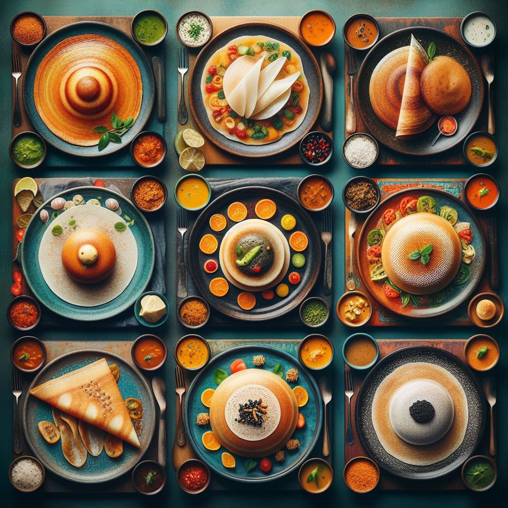
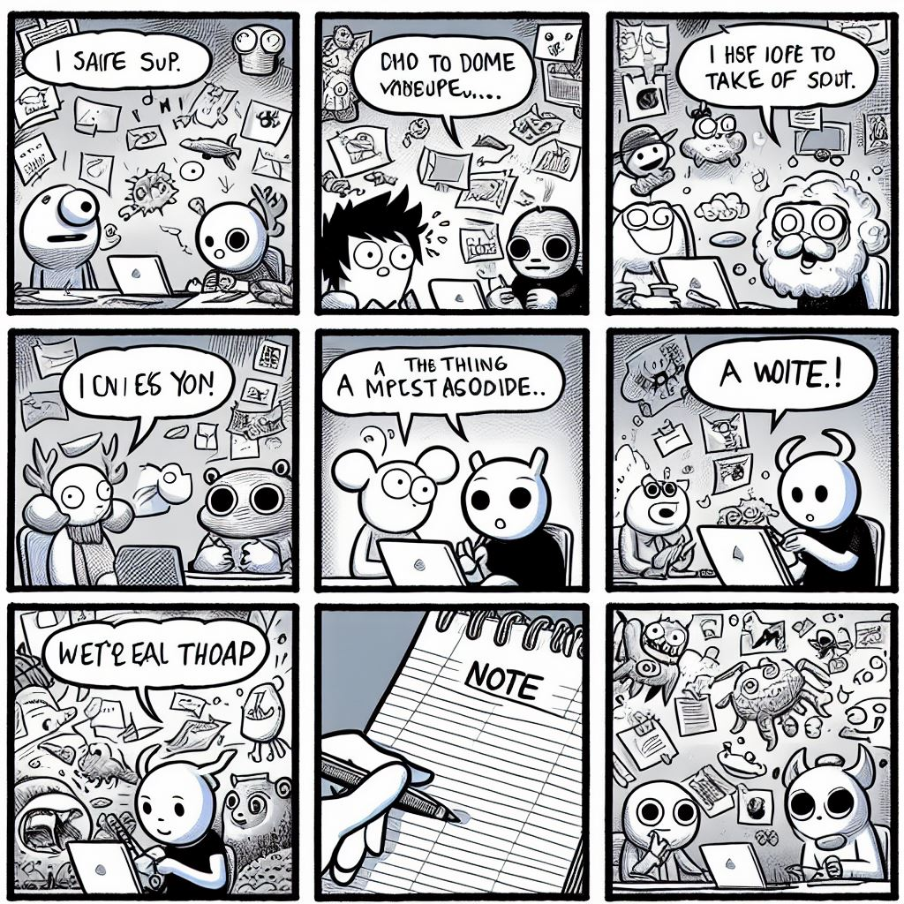
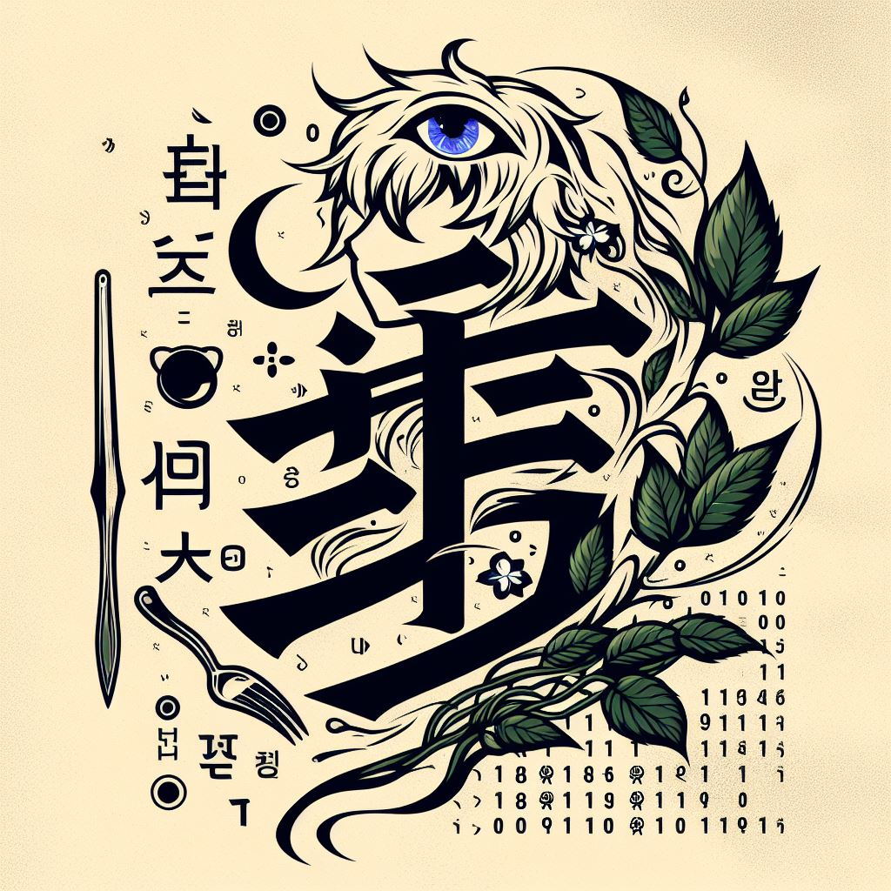

 

<!--  -->

<h1 align="center">  My Work </h1>

 
|  |   |  |
| -- | -- |  -- |

<!--- -- About ME  -->

<h1 align="center" >    Software Engineer  </h1>

🧠  AI-ML \& Hardware engineer from India, super into Open Source.

🔭 I’m currently working on [FPGA Hardware](https://github.com/charudatta10/hdl-codes-glowing-octo-invention)

🌱 I’m currently learning **FPGA, GAN \& NNGEN**

👯 I’m looking to collaborate on [AI ML EDGE on  devices](https://github.com/charudatta10/hdl-codes-glowing-octo-invention)

🤝 I’m looking for help with [Python to edge flow NNGEN](https://github.com/charudatta10/hdl-codes-glowing-octo-invention)

👨‍💻 All of my projects are available at [https://github.com/charudatta10](https://github.com/charudatta10)

💬 Ask me about **Genetic Algorithm, GANs, FPGAs, MFDFA**

📫 How to reach me **Korde.charudatta@gmail.com**

🎯 my goal is advancing your expertise and contributions in areas:
 
 - AI and Machine Learning,
 - Open Source Contributions, 
 - Collaboration and Learning,
 - Research and Development.

✨ my colobrative efforts and contribution

 - Open Source Projects: You’ve contributed to various open-source projects, which often involve collaboration with other developers. This includes your work on handwritten Devanagari script recognition and other Python scripts.
 -  Research Collaboration: As a research scholar at NIT Goa, you have guided and collaborated with final-year bachelor’s and master’s students on lab and project work. 
 -  Community Engagement: Your involvement in creating and maintaining repositories, such as the README generator and Neovim configuration, indicates a commitment to sharing knowledge and tools with the developer community. 

🏆 I participated in poster compettion presenting my reserch work. I also participated in state level chess competation. 

🎓 I'm pursuing a PhD in VLSI with [NITGOA](https://nitgoa.ac.in/).

🚀 Here are  my some of  achivements:
 
 - Handwritten Devanagari Script Recognition: Developed an open-source project focused on recognizing handwritten Devanagari script characters using MATLAB1.
 - Improved Barnacle: Created a Python script for cleanup tasks1.
 - Readme Generator: Built a tool to generate README files for GitHub repositories1.
 - Blog: Maintained a blog hosted on GitHub, featuring articles on privacy, data security, and GANs1.
 - Neovim Configuration: Customized Neovim to function like an IDE with fast startup times1. 
 - Research and Teaching: As a research scholar at NIT Goa, you have guided final-year bachelor’s and master’s students in lab and project work1.

🎁 my work [portfolio](https://charudatta10.github.io/myblog/portfolio/project.html).

😄 My key philosopies are kaizen, ikegai, wabi-sabi, zen of life.

🔥 "You must be the change you wish to see in the world." -Mahatma Gandhi

<!--- -- Skills Section ------->

<h1 align="center">   Skills Sets  </h1>

 

| AI models | ML & DL | IDE/Editors | Software | Tools &          Services |                                                                   
| :----------------: | :------------------: | :-------------------: | :--------------------: | :-----------------: | 
|  |   |          |    |  |    
|  |  |     |       |     |  
|  |    |        |  |      |  
|   |     |  |  |  | 

<!-- BLOG-POST-LIST -->

<h1 align="center" >    Blog Posts </h1>

- [exploring the legendary dollop repository an svg generator](https://dev.to/charudatta10/exploring-the-legendary-dollop-repository-an-svg-generator-4388)
- [Organization schemes for note taking](https://dev.to/charudatta10/organization-schemes-for-note-taking-j18)
- [VS Code for Note-Taking](https://dev.to/charudatta10/vs-code-for-note-taking-324b)
- [Improved-Barnacle repository: (The Cleanup Python Script)](https://dev.to/charudatta10/improved-barnacle-repository-the-cleanup-python-script-172d)
- [Vscode setup with Foam and Logseq for Digital Note Taking](https://dev.to/charudatta10/vscode-setup-with-foam-and-logseq-for-digital-note-taking-2953)

  
  
- [Collaborative Note-Taking with AI: Tools that Facilitate Teamwork and Knowledge Sharing](https://dev.to/charudatta10/collaborative-note-taking-with-ai-tools-that-facilitate-teamwork-and-knowledge-sharing-2i3p)
- [Visual Note-Taking Apps: Unleashing Creativity with AI-Driven Mind Maps and Doodles](https://dev.to/charudatta10/visual-note-taking-apps-unleashing-creativity-with-ai-driven-mind-maps-and-doodles-hfp)
- [Introduction to Digital Note-Taking: A Beginner's Guide](https://dev.to/charudatta10/introduction-to-digital-note-taking-a-beginners-guide-9p2)
- [Why Obsidian Falls Short as a Note-Taking Tool](https://dev.to/charudatta10/why-obsidian-falls-short-as-a-note-taking-tool-3ef2)
- [Customizing AI Prompts for Note-Taking: Tips for Tailoring Your AI-Generated Prompts](https://charudatta10.github.io/myblog/blog/index.html)
  
<!--- -- GitHub Stats --------->

<h1 align="center">  GitHub Stats </h1>

<!----- Activity Graph ------>

| |  |
| -- | -- |
|  |  |

|  |  |
|  - | - |

<h1 align="center">  Fun Bubbles </h1>

|  |  |
| - | - |

<!--- -- Projects Section ------------>

<h1 align="center">  Pinned Projects  </h1>

