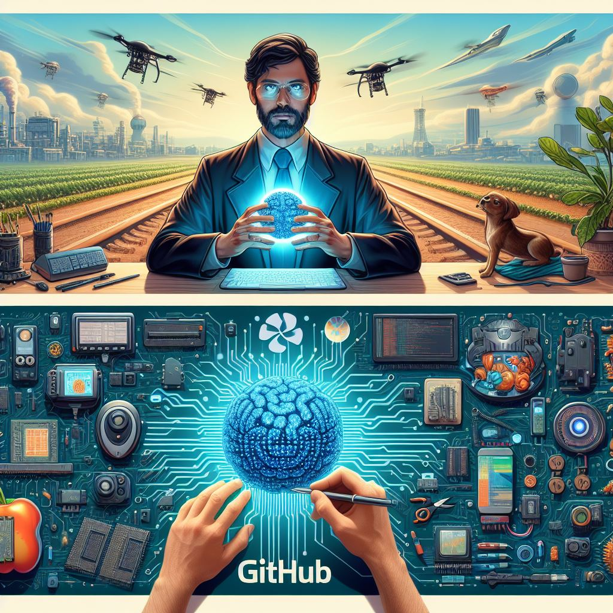
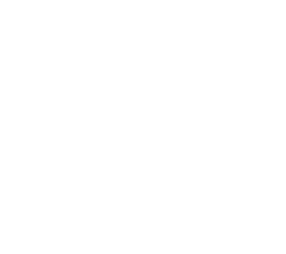
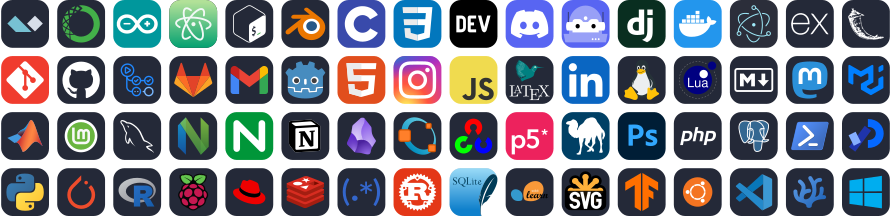
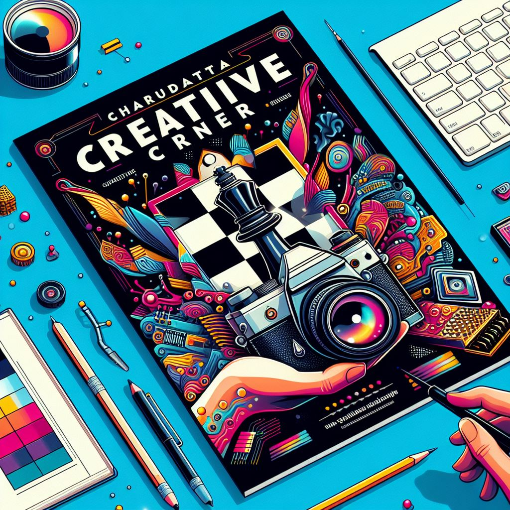
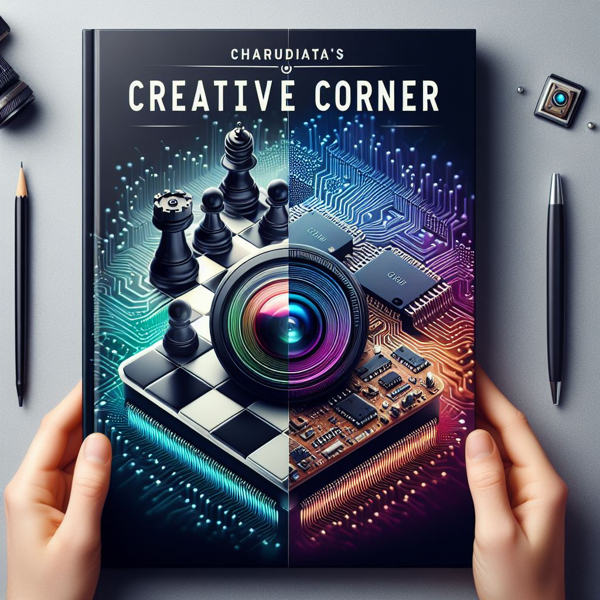
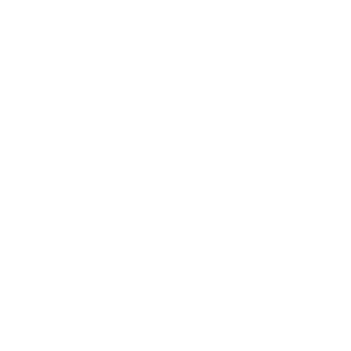
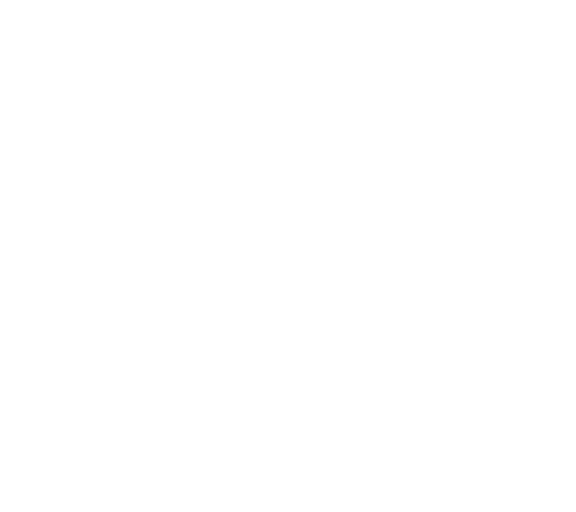

<!-- 
 -->

# ⠯⠷ Engineer (AI-ML, FPGA) | Open Source Enthusiast

Welcome to My GitHub Profile!

Hi there! I'm Charudatta Korde, a passionate engineer and open-source enthusiast specializing in AI-ML, FPGA development, and blockchain technology. Based in Goa, India, I am currently pursuing my PhD in VLSI at NIT Goa, focusing on designing optimized FPGA/Edge device accelerators for AI/ML (GAN) models.

In this repository, you'll find detailed sections about my work, projects, skills, achievements, and more. Explore my contributions to open-source projects, read my blog posts, check out my portfolio, and see how I'm leveraging technology to create innovative solutions. Let's connect and collaborate on exciting projects!

#  My Work

|  |   |  |
| -- | -- | -- |

 <h1> 🤵 About me </h1> 

🌍  I'm based in Goa, India 403005.

🖥️ See my portfolio at [portfolio](https://charudatta10.github.io/portfolio/).

✉️  You can contact me at Korde.charudatta@gmail.com.

🧠  I'm learning: 

⚛ FPGA Technologies: Expanding my knowledge and skills in Field-Programmable Gate Arrays.  

☘ GANs (Generative Adversarial Networks): Exploring advanced AI models and their applications.  

⚘ NNGEN (Neural Network Generation): Working on Python to edge flow for deploying neural networks on edge devices.  

✐ MFDFA (Multifractal Detrended Fluctuation Analysis): Delving into complex data analysis techniques.  

❄ Blockchain and Smart Contracts: Investigating the potential of blockchain technology and smart contracts for various applications.  

🤝  I'm open to collaborating on Python to edge flow NNGEN, Genetic Algorithm, GANs, FPGAs, MFDFA, and AI ML EDGE on devices.

🎓 I'm pursuing a PhD in VLSI at NIT Goa on the topic "Design optimized FPGA/Edge device accelerators for AI/ML(GAN) models."

🔭 Currently working on FPGA Development, AI and machine learning, Blockchain and Smart Contracts, Python to Edge Flow NNGEN.

🎯 My goal is to advance my expertise and contributions in the areas of FPGA development, AI-ML, and open-source projects.

🌱 My key philosophies:  
  

⚡ "Be afraid and do it anyway." 

⚡ "Right now is the only guarantee." 

⚡ "Be a voice. Not an echo."  

⚡ "It will all make sense eventually."  

⚡ "Don’t be afraid to dream big."  

⚡ "Fearlessness is the mother of reinvention."  

🔥 "You must be the change you wish to see in the world." - Mahatma Gandhi

✨ I’m passionate about leveraging technology to create innovative solutions that have a positive impact on the world.

| **Area** | **Position** | **Projects** | **Learning** | **Comments** |
| --- | --- | --- | --- | --- |
| AI-ML, Python, Open Source | Research Scholar | Handwritten Devanagari Script Recognition, Improved Barnacle, Readme Generator, Python to edge flow NNGEN | Genetic Algorithm, GANs, FPGAs, MFDFA, GAN, NNGEN | Currently doing PhD at NIT Goa |
| AI-ML, FPGA Hardware | Software Validation Engineer | FPGA Hardware projects | FPGA, Qurtus | Previously interned with Intel |
| FPGA, AI-ML, Blockchain, Smart Contracts | Researcher, Developer | FPGA development, Blockchain and smart contract projects, Advanced AI-ML models | FPGA technologies, Advanced blockchain technologies | Future work interests |

 <h2> 🏆 Achievements  </h2> 

➻ Developed an open-source project for recognizing handwritten Devanagari script characters using MATLAB.  

➸ Created a Python script for cleanup tasks.  

➳ Built a tool to generate README files for GitHub repositories.  

➼ Customized Neovim to function like an IDE with fast startup times.  

➨ Participated in a poster competition presenting research work.  

➤ Participated in a state-level chess competition.  

   
  
  
  

 <h1>  My Knowledge & Skills  </h1> 

`Verilog` `FPGA` `Phi-3:7B` `Gemma-2:2B` `Mistral` `Ollama` `Crewai` `Langchain` `Blockchain`

     

<!-- BLOG-POST-LIST -->

 <h1 align="center" >    Blog Posts </h1> 

- [exploring the legendary dollop repository an svg generator](https://dev.to/charudatta10/exploring-the-legendary-dollop-repository-an-svg-generator-4388)
- [Organization schemes for note taking](https://dev.to/charudatta10/organization-schemes-for-note-taking-j18)
- [VS Code for Note-Taking](https://dev.to/charudatta10/vs-code-for-note-taking-324b)
- [Improved-Barnacle repository: (The Cleanup Python Script)](https://dev.to/charudatta10/improved-barnacle-repository-the-cleanup-python-script-172d)
- [Vscode setup with Foam and Logseq for Digital Note Taking](https://dev.to/charudatta10/vscode-setup-with-foam-and-logseq-for-digital-note-taking-2953)

  
  
- [Collaborative Note-Taking with AI: Tools that Facilitate Teamwork and Knowledge Sharing](https://dev.to/charudatta10/collaborative-note-taking-with-ai-tools-that-facilitate-teamwork-and-knowledge-sharing-2i3p)
- [Visual Note-Taking Apps: Unleashing Creativity with AI-Driven Mind Maps and Doodles](https://dev.to/charudatta10/visual-note-taking-apps-unleashing-creativity-with-ai-driven-mind-maps-and-doodles-hfp)
- [Introduction to Digital Note-Taking: A Beginner's Guide](https://dev.to/charudatta10/introduction-to-digital-note-taking-a-beginners-guide-9p2)
- [Why Obsidian Falls Short as a Note-Taking Tool](https://dev.to/charudatta10/why-obsidian-falls-short-as-a-note-taking-tool-3ef2)
- [Customizing AI Prompts for Note-Taking: Tips for Tailoring Your AI-Generated Prompts](https://charudatta10.github.io/myblog/blog/index.html)

<!--- -- GitHub Stats --------->

 <h1>  GitHub Stats </h1> 

<!----- Activity Graph ------>

| |  |
| -- | -- |
|  |  |

|  |  |
|  - | - |

<!--- Fun Section ------------>

 <h1>  Fun Bubbles </h1> 

 
|  |  |
| - | - |

<!--- -- Projects Section ------------>

 <h1>  Pinned Projects  </h1> 

- [`download-cleaner`](https://github.com/charudatta10/download-cleaner): Organizes the download folder by moving files by extension.
- [`web3-tools`](https://github.com/charudatta10/web3-tools): Web3 technology tools aggregator project.
- [`project-manager`](https://github.com/charudatta10/project-manager): One solution to all your project management tasks. 
- [`template-project`](template-project): Create boilerplate for your project.

