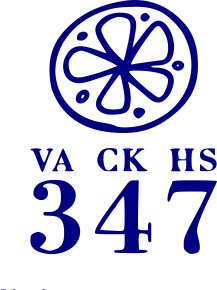
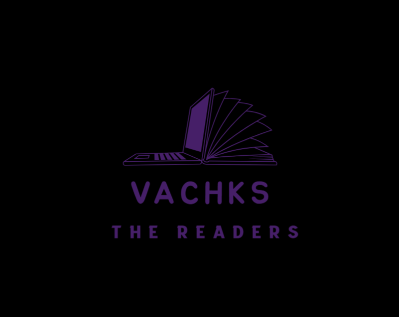

## **Charudatta Korde | AI-ML, Cybersecurity & FPGA Specialist**

>
> *Optimising neural networks for edge devices, building open-source AI solutions, mentoring the next generation*

## Current Focus

- 🧠 Optimising AI models for FPGA deployment
- 🏗️ Contributing to NNGEN for neural network acceleration
- 🔗 Exploring blockchain applications in edge computing
- 👨‍🏫 Mentoring students at NFSU Goa

## 🔥 Skills

| 🔵 **Expert** | 🟢 **Proficient** | 🟡 **Intermediate** |
|-------------|----------------|----------------|
| Python      | FPGA Design    | Web Development|
| PyTorch     | C Programming  | Julia          |
| NNGEN       | Git/GitHub     | Scikit-learn   |
| HTML/CSS    | Verilog        | SQLite        |

## 📊 GitHub Activity

Here's an overview of my GitHub activity, including contributions, top languages, and achievements.  

## ⭐ Featured Projects

1. **[AI Trade](https://github.com/charudatta10/ai-trade)** - AI trade bot
   - *Tech: Python, Ollama, Fastapi, YFinance, News API, Text Blob*
   - *Impact: trade margins improved by 50%*

2. **[AI Chat](https://github.com/charudatta10/ai_chat)** - Lightweight conversational AI platform
   - *Tech: Python, Ollama, FastAPI*
   - *Impact: Reduced response latency by 30% compared to alternatives by utilising asynchronous routines with Fastapi*

3. **[Handwritten Devanagari Recognition](https://github.com/charudatta10/devanagari-handwriting-recognizer)**
   - *Tech: TensorFlow, Keras, NumPy*
   - *Result: 94% accuracy on real-world handwritten samples*

4. **[Web3 Tools](https://github.com/charudatta10/web3-tools)**
   - *Tech: Python, Flask, Web3.py*
   - *Features: Smart contract deployment, wallet management, transaction analysis*

## 📚 Recent Publications & Blog Posts

- [VS Code for AI-Enhanced Note-Taking](https://dev.to/charudatta10/vs-code-for-note-taking-324b)
- [AI-Optimised FPGA Deployments: Challenges & Solutions](https://dev.to/charudatta10/ai-optimized-fpga-deployments-challenges-solutions-2mij)

## 🏆 Recent Achievements

- Mentored six students through their master's theses (2025)
- Completed RG Marathon 5K (2024)

## **🌐 Call-to-Action**

Looking for **collaborators or consulting opportunities** in AI and FPGA? Let’s connect!  

## ©️ COPYRIGHT NOTICE

© 2025 Charudatta Korde. Some Rights Reserved. Attribution Required. Non-Commercial Use & Share-Alike. 

#    

